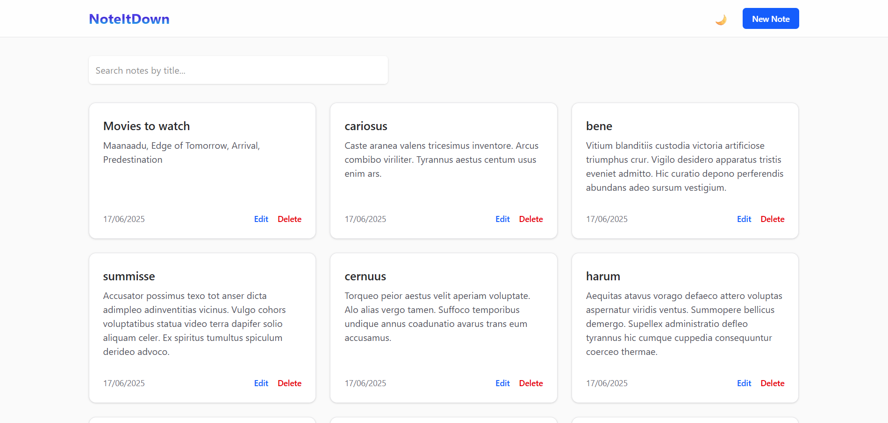

# NoteItDown - Notes Application
This project is a simple, clean, and fully responsive web application for managing notes. It allows users to view, create, update, and delete notes, all while interacting with a mock API backend. The application features a modern, aesthetic design with light and dark modes.

This project was built using Svelte and TailwindCSS v4, bootstrapped with Vite.



## ✨ Features
- **Full CRUD Functionality**: Create, Read, Update, and Delete notes.
- **Aesthetic & Responsive UI**: Clean, modern interface that works seamlessly on desktop and mobile devices.
- **Dark Mode**: Easy-to-toggle light and dark themes with user preference persistence.
- **Client-Side Search**: Instantly filter notes by title.
- **Client-Side Pagination**: View notes in paginated sets of 20.
- **Client-Side Sorting**: Newly created or updated notes correctly appear at the top of the list.
- **Enhanced UX**: Includes loading spinners for asynchronous operations and confirmation modals for destructive actions.

## 🛠️ Tech Stack
- **Frontend**: Svelte, Javascript, Html
- **Styling**: TailwindCSS
- **Build Tool**: Vite
- **API**: Mock API backend provided by mockapi.io

## 🚀 How to Run the App Locally
Follow these steps to get the application running on your local machine.
### Prerequisites
- Node.js (v18 or higher recommended)
- npm (usually comes with Node.js)

### Setup Steps
Clone the repository:
```BASH
git clone https://github.com/tejasg99/Notes-app.git
cd notes-app
```
Install dependencies:
```BASH
npm install
```
Configure the API Endpoint:
This is the most important step. You need to connect the application to your personal MockAPI endpoint.
- Open the file src/api.js.
- Find the BASE_URL constant at the top of the file.
- Replace the placeholder URL with your actual MockAPI base URL.
```JAVASCRIPT
// src/api.js
// IMPORTANT: Replace this with your actual mockapi.io base URL!
const BASE_URL = 'https://YOUR_MOCKAPI_URL.mockapi.io/api/v1';
```
Run the development server:
```BASH
npm run dev
```
Open the app:
Navigate to http://localhost:5173 in your web browser. The application should now be running.

## 🤔 Trade-offs and Assumptions
During development, several key decisions and assumptions were made:
### Client-Side Logic vs. Server-Side Logic (The Biggest Trade-off):
- **Initial Goal**: To rely on the API for server-side sorting and pagination.
- **Problem**: It was discovered that the mock API service did not reliably support server-side sorting by the updatedAt field.
- **Final Decision**: The architecture was refactored to handle all business logic on the client side. The application now fetches the entire list of notes from the API on initial load and after any mutations (create, update, delete). All filtering, sorting, and pagination are then performed in-memory on the client using Svelte's reactive system.
- **Implication**: This approach is highly responsive and fast for small-to-medium datasets (up to a few thousand notes). However, it does not scale to very large datasets (e.g., 100,000+ notes), as the initial load time would become prohibitive. For a production application at that scale, a backend with guaranteed sorting and pagination would be required.

### No User Authentication:
- **Assumption**: The application operates without user accounts. All notes are public and are managed in a single, shared list. This is in line with the requirements of the assignment but would be the first feature to add for a real-world application.

### API Schema:
- **Assumption**: The MockAPI endpoint is configured with the correct notes resource and schema, including title (String), content (String), createdAt (Date), and updatedAt (Date).

## 🔮 What I'd Do With More Time
Given more time, I would focus on the following improvements to move the project from a functional prototype to a production-ready application:
### Migrate to a Robust Backend and Add Authentication:
- Replace `mockapi.io` with a real backend service like `Supabase`, `Firebase`, or a custom `Node.js/Express API`.
- Implement user authentication (e.g., with JWTs or an OAuth provider) so that each user has their own private set of notes.
### Adopt SvelteKit:
- For an application with multiple views (like user profiles, settings pages, etc.), migrating to `SvelteKit` would be ideal. It provides a robust file-based router, server-side rendering (SSR) capabilities, and a more structured approach to data loading that would simplify the codebase.
### Advanced State Management:
- While component-level state is sufficient for this app, a larger application would benefit from Svelte's built-in stores. I would refactor the notes list and loading states into a custom writable store to make the state easily accessible across different components and routes.
### Enhanced User Experience:
- Replace browser `alert()` popups with non-blocking `toast notifications` for a smoother user experience when saving or deleting notes.
- `Debounce` the search input to prevent excessive re-renders while the user is typing, which would be more critical if we were making API calls on each keystroke.
### Comprehensive Testing:
- Implement a testing suite using `Vitest` for unit tests (e.g., testing the sorting logic) and `Playwright` for end-to-end tests to simulate user flows like creating a note, editing it, and deleting it.